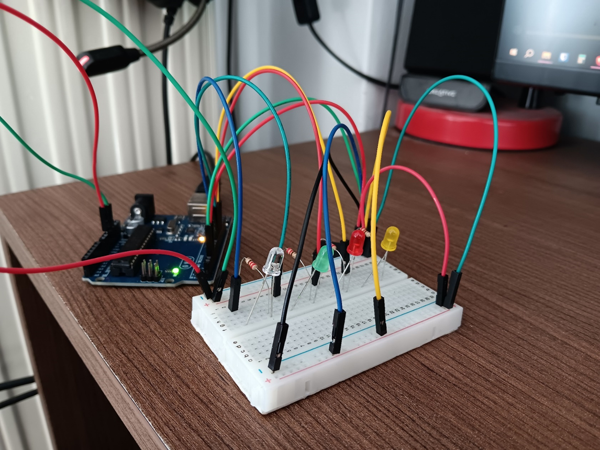

# Εφαρμογη εξ’ αποστασεως ελεγχου

# ΠΡΟΒΛΗΜΑ

- Πόσες φορές έχουμε έρθει αντιμέτωποι με την υποψία πως έχουμε ξεχάσει μία ηλεκτρική συσκευή ανοικτή στο σπίτι μας;
- Πόσες φορές γυρίσαμε πίσω για να το ελέγξουμε και εν τέλει ήταν κλειστή;

# **ΣΚΟΠΟΣ**

Σκοπός της εργασίας είναι η υλοποίηση μιας εφαρμογής εξ’ αποστάσεως ελέγχου ηλεκτρικών συσκευών. Συγκεκριμένα η υλοποίηση μας αφορά τη δημιουργία ενός οικοσυστήματος ΙοΤ με χρήση Arduino και ενός ESP01 το οποίο θα είναι σε θέση να ελέγχει την ενεργοποίηση και απενεργοποίηση LED φωτιστικών σωμάτων. Ο έλεγχος πραγματοποιείται απομακρυσμένα μέσω της διαδικτυακής πλατφόρμας Blynk, με στόχο την παροχή δυνατότητας ελέγχου του φωτισμού από οποιοδήποτε σημείο.

# ΘΕΩΡΗΤΙΚΟ ΥΠΟΒΑΘΡΟ

**Internet of Things (IoT):** Το Internet of Things (IoT) αναφέρεται στο δίκτυο φυσικών συσκευών που διαθέτουν αισθητήρες, ενεργοποιητές και έχουν δυνατότητα σύνδεσης στο διαδίκτυο, επιτρέποντας τον απομακρυσμένο έλεγχο των συσκευών καθώς και τη συλλογή και ανταλλαγή δεδομένων.

Ένα σύστημα χαρακτηρίζεται ως IoT μόνο όταν συνδυάζει φυσικές συσκευές, σύνδεση στο Internet, cloud υπηρεσίες και διεπαφή χρήστη. Οι συσκευές IoT χρησιμοποιούνται σε εφαρμογές όπως: έξυπνα σπίτια (Smart Home), βιομηχανικούς αυτοματισμούς (industrial automation), συστήματα παρακολούθησης και ελέγχου.

**Αρχιτεκτονική IoT Συστήματος:** Ένα τυπικό σύστημα IoT αποτελείται από:

1. Φυσικό επίπεδο (hardware – αισθητήρες, ενεργοποιητές)
2. Επίπεδο δικτύου (Wi-Fi, Internet)
3. Επίπεδο cloud
4. Επίπεδο εφαρμογής (mobile/web app)

Η συνεργασία αυτών των επιπέδων επιτρέπει τον απομακρυσμένο έλεγχο συσκευών.

**Arduino:** Είναι μια πλακέτα η οποία βασίζεται σε έναν μικροελεγκτή **ATmega328P**, έχει μνήμη καθώς και θύρες εισόδου/εξόδου (GPIO) και επιπλέον περιλαμβάνει κυκλώματα για τροφοδοσία, επικοινωνία και προγραμματισμό.

Το **ESP8266** είναι ένα Wi-Fi module που επιτρέπει σε μικροελεγκτές να συνδεθούν στο διαδίκτυο.
Λειτουργεί ως ενδιάμεσος κρίκος μεταξύ του Arduino και του Cloud. Η επικοινωνία μεταξύ Arduino και ESP01 γίνεται μέσω σειριακής επικοινωνίας (UART).

**Cloud Computing στο IoT:** Το **Cloud Computing** επιτρέπει την αποθήκευση, επεξεργασία και διαχείριση δεδομένων σε απομακρυσμένους servers. Στα συστήματα IoT, το cloud λαμβάνει δεδομένα από συσκευές, τα επεξεργάζεται, τα προωθεί σε εφαρμογές χρηστών. Το **Cloud** λειτουργεί ως ενδιάμεσος κόμβος επικοινωνίας μεταξύ χρήστη και συσκευής.

**Blynk platform**: Το **Blynk** είναι πλατφόρμα ανάπτυξης IoT εφαρμογών που επιτρέπει τον απομακρυσμένο έλεγχο συσκευών μέσω web/mobile app. Χαρακτηριστικά: χρήση **Virtual Pins**, cloud server, mobile εφαρμογή, εύκολη υλοποίηση χωρίς σύνθετο backend.

# **ΜΕΘΟΔΟΣ ΕΠΙΛΥΣΗΣ**

## **Αρχιτεκτονική λύσης**

Ο εξ’ αποστάσεως έλεγχος των LEDs γίνεται μέσο mobile/web εφαρμογής στο περιβάλλον Blynk. Έχουμε δημιουργήσει στην εφαρμογή μέσο κατάλληλων components ένα διακόπτη switch για κάθε ένα φωτιστικό σώμα που θέλουμε να ελέγξουμε. Κάθε αλλαγή που προκαλείται στα switches στέλνεται απο το Blynk μέσο ενός API ως σήμα στο Arduino. Το Arduino είναι σε θέση να δεχτεί απομακρυσμένα πακέτα λόγο του Wi-Fi module ESP01 που του έχουμε συνδέσει. Η μεταξύ τους επικοινωνία πραγματοποιείται σε baud 9600 προκειμένου να μην έχουμε θέματα απώλειας πακέτων λόγο μεγέθους. Αφού δεχτεί το σήμα το Arduino μεταφέρει τις αλλαγές στα leds τα οποία έχει συνδεδεμένα στις κατάλληλες ακίδες του.

## **Υλικό**

- Μικροελεγκτής (Arduino UNO_R3)
- Wi-Fi module (ESP01)
- Αντιστάσεις (220 Ohms) και LEDs (Yellow, Red, Green, Blue)

## **Λογισμικό - Πλατφόρμα**

- Blynk (Web/Android/iOS App)
- Arduino IDE

## **Πρωτόκολλα**

- Wi-Fi (IEEE 802.11)
- TCP/IP
- HTTP/HTTPS
- Blynk Protocol

# ΚΥΚΛΩΜΑ

Στην τοπολογία υπάρχουν 4 leds (yellow, red, green, blue) στα οποία έχει αντιστοιχηθεί η άνοδος του καθενός από αυτά με ένα pin στο Arduino (pin11, pin10, pin9, pin8 αντίστοιχα) ούτος ώστε να μπορούμε να τα ελέγχουμε ανεξάρτητα το ένα από το άλλο. Στην κάθοδο των leds έχει προσαρμοστεί μια αντίσταση των 220Ω καθώς δεν μπορούν να διαχειριστούν τάση 3.3V το οποίο παρέχεται από την τροφοδοσία του Arduino.

Παράλληλα με αυτή τη συνδεσμολογία υπάρχει και αυτή του ESP01 με το Arduino. Σε αυτή τη περίπτωση το ESP01 συνδέεται στα κατάλληλα pins του Arduino έτσι ώστε να μπορεί να στείλει και να λάβει δεδομένα από αυτό επιστρατεύοντας τις αντίστοιχες θύρες tx και rx.

## ΛΕΙΤΟΥΡΓΙΕΣ

> [https://blynk.cloud/dashboard/login](https://blynk.cloud/dashboard/login)

Στο περιβάλλον Blynk έχουμε δημιουργήσει ένα οικοσύστημα με τη χρήση 2 widgets, του switch και του led. Ο τρόπος λειτουργίας του συγκεκριμένου περιβάλλοντος είναι ο εξής:
Όταν πατήσουμε έναν ή παραπάνω διακόπτες θα πρέπει να μεταβληθεί η κατάσταση τους (από on σε off και το αντίστροφο) ταυτόχρονα με την αλλαγή της κατάστασης του switch θα πρέπει να αλλάξει και η κατάσταση στο εκάστοτε led.

Τα leds είναι συνδεδεμένα με τα datastreams των switches καθαρά χάριν διευκόλυνσης του χρήστη. Όταν τα led μετάβουν από την κατάσταση OFF σε κατάσταση ON τότε θα πρέπει να ανάψουν τα leds της εφαρμογής τα οποία έχουν ίδια χρώματα με αυτά που χρησιμοποιήθηκαν στο φυσικό κύκλωμα. Μέσο του API του Blynk θα πρέπει να στείλει σήμα στο Arduino μέσω του ESP01 και αυτό με τη σειρά του να ενεργοποιήσει τα led που πρέπει στην τοπολογία μας.

# **ΣΥΜΠΕΡΑΣΜΑΤΑ**

Μέσω αυτής της εργασίας θέλαμε να δείξουμε μια πρακτική εφαρμογή IoT που να λύνει ένα πρόβλημα της καθημερινότητας με απλό και γρήγορο τρόπο.

Καθοριστική σημασία σε αυτό έπαιξε το περιβάλλον του Blynk, καθώς είναι μια all-in-one λύση που μπορεί να εξυπηρετήσει μια πληθώρα εφαρμογών χωρίς σχεδόν κανένα περιορισμό. Μέσω του εύκολου interface απλοποιείται σε μεγάλο βαθμό η διαδικασία απομακρυσμένου ελέγχου συσκευών.

Η παρούσα εργασία μπορεί να μας δώσει μια πρώτη γεύση όσον αφορά τη διαδικασία που πρέπει να ακολουθήσουμε εάν θέλουμε να ξεκινήσουμε να διαχειριζόμαστε απομακρυσμένα συσκευές. Ωστόσο η ιδέα αυτή μπορεί να εξελιχθεί σε κάτι πολύ μεγαλύτερο εντάσσοντας μέσα στο κύκλωμα αισθητήρες, ρελέ κτλ.

# ΜΕΛΛΟΝΤΙΚΕΣ ΕΠΕΚΤΑΣΕΙΣ

Ο απομακρυσμένος έλεγχος συσκευών μπορεί να επεκταθεί σαν λύση ακόμα περισσότερο από το να μετατρέψει ένα σπίτι smart. Για παράδειγμα σε μια μεγαλύτερη εγκατάσταση όπως μια εταιρία θα μπορούσαμε να έχουμε υποδομή τέτοια ώστε να μπορούμε να διαχειριζόμαστε μεγαλύτερο πλήθος συσκευών ενώ ταυτόχρονα πέρα από την παρακολούθηση και τον έλεγχο να αποθηκεύουμε τα δεδομένα που συλλέγονται προκειμένου να τα αξιοποιήσουμε προς όφελος του διαχειριστή.

Τέτοια δεδομένα μπορεί να είναι η θερμοκρασία και η υγρασία σε ένα χώρο. Έχοντας πρόσβαση σε τέτοια δεδομένα μπορούμε να αυτοματοποιήσουμε διαδικασίες όπως ο κλιματισμός προκειμένου να αποφύγουμε την σπατάλη ενέργειας καθώς και την πρόκληση διάφορων βλαβών. Η αύξηση της θερμοκρασίας μπορεί να οδηγήσει σε υπερθέρμανση μηχανών με καταστροφικά αποτελέσματα για μια επιχείρηση, όπως επίσης και η έγκαιρη ανίχνευση υγρασίας σε μια αγροτική έκταση μπορεί να βοηθήσει τον γεωργό να προλάβει τυχόν ζημίες στις καλλιέργειες του.

Επομένως συσκευές IoT βλέπουμε ότι μπορούν να μας κάνουν και πολύ πιο αποδοτικούς σε διάφορους τομείς της ζωής μας.
